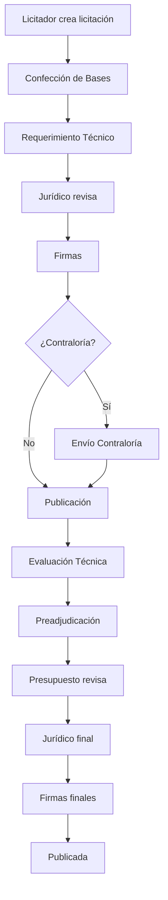

# Resumen Ejecutivo - Sistema HRR Licitaciones

## Objetivo de la Documentación
Esta documentación ha sido generada para facilitar la **migración del sistema de gestión de licitaciones del Hospital Regional Rancagua** a otra tecnología. Contiene descripciones detalladas de diseño, funcionalidad, API endpoints, y consideraciones técnicas de todos los componentes del sistema.

---

## 📊 Estadísticas del Proyecto

### Componentes Documentados
- **12 Vistas Principales** (views/private) ✅
- **12 Modales** (modals) - En progreso (3/12 completados)
- **1 Componente de Categorías** (FormatoBases)
- **4 Componentes de Navegación**

**Total**: 29 componentes

### Líneas de Código Estimadas
- Frontend: ~15,000+ líneas
- Componentes React: 29 archivos principales
- Estilos CSS: Múltiples archivos

---

## 🏗️ Arquitectura Actual

### Stack Tecnológico

#### Frontend
- **React 18+**: Framework principal con Hooks
- **React Router v6**: Navegación SPA
- **Mantine Core v5**: Sistema de componentes UI
- **Ant Design v5**: Tablas, formularios, modales
- **Tabler Icons**: Iconografía
- **Axios**: Cliente HTTP

#### Gestión de Estado
- **React Context API**: Autenticación (authContext)
- **useState/useEffect**: Estado local
- Sin gestión global centralizada

#### Estilos
- **Mantine createStyles**: Styles in JS
- **CSS Modules**: Archivos .css independientes
- Mix de estilos inline y clases

#### Utilidades
- **Day.js**: Manejo de fechas
- **date-fns**: Formateo de fechas
- **XLSX**: Exportación a Excel
- **rutlib**: Validación RUT chileno
- **react-highlight-words**: Búsqueda con resaltado

---

## 🎯 Funcionalidades Principales del Sistema

### 1. Gestión de Licitaciones
- **Crear licitaciones**: 5 formatos diferentes (Adquisición, Contraloría, Contrato, Suministro, Otros Trámites)
- **Workflow configurable**: 4-13 pasos según formato
- **Sistema de turnos**: Cada rol tiene su turno en el proceso
- **Devoluciones**: Con motivo y tracking
- **Historial completo**: Auditoría de cambios y observaciones
- **Documentos adjuntos**: Por proceso

### 2. Plan Anual de Compras (PAC)
- **Carga masiva**: Desde archivos Excel
- **Visualización por año**: Con desglose mensual
- **Consolidado**: Vista integrada con búsqueda avanzada
- **Exportación**: Generación de reportes

### 3. Requerimientos de Abastecimiento
- **Gestión de productos**: Con stock y cantidades programadas
- **Timeline de historial**: Visual con Mantine
- **Documentos**: Adjuntos por requerimiento
- **Estados**: Workflow de seguimiento

### 4. Gestión de Usuarios
- **CRUD completo**: Crear, editar, activar/desactivar
- **6 Roles diferentes**: Con permisos granulares
- **Validación RUT**: Integrada
- **Seguridad**: No eliminación física

### 5. Novedades
- **Sistema de noticias**: Con imágenes
- **Vista pública y administrativa**
- **Gestión de contenido**: Solo Super Admin

### 6. Formatos de Bases
- **4 Categorías**: Medicamentos, Insumos, Servicios, Otros
- **Documentos PDF/Word**: Almacenamiento y descarga
- **Gestión por categoría**: Organizados visualmente

---

## 👥 Sistema de Roles y Permisos

### Super Admin
- **Acceso total**: Todos los módulos
- **Usuarios**: Gestión completa
- **Licitaciones**: Vista global y edición
- **Configuración**: Bases, novedades

### Licitador
- **Licitaciones propias**: Crear y gestionar
- **Bandeja de entrada**: Filtrada por turno

### Secretaria Abastecimiento
- **PAC**: Gestión completa
- **Requerimientos**: CRUD de abastecimiento
- **Consolidado**: Visualización

### Secretario Jurídico
- **Revisión legal**: Proceso jurídico
- **Bandeja**: Solo turno jurídico

### Presupuesto
- **Revisión presupuestaria**: Validación de montos
- **Bandeja**: Solo turno presupuesto

### Subdireccion Administrativa
- **Aprobaciones**: Administrativas
- **Bandeja**: Solo su turno

---

## 🔄 Flujos Críticos del Sistema

### Flujo de Licitación Completo



### Sistema de Devoluciones
1. Usuario detecta problema
2. Devuelve a proceso anterior
3. Ingresa motivo
4. Sistema registra en historial
5. Notifica al responsable del proceso destino

---

## 📡 Patrones de API

### Endpoints Principales

#### Licitaciones
- `GET /api/CombinedQuerysUsersLicitacion`: Licitaciones + usuarios
- `POST /api/createLicitacion`: Nueva licitación
- `PUT /api/updateLicitacion/:id/:userId`: Actualizar
- `POST /api/avanzarLiquidacion/:id/:userId`: Avanzar proceso
- `PUT /api/devolverLicitacion/:id`: Devolver con observación

#### PAC
- `GET /api/getPacs/:year`: PAC por año
- `GET /api/getConsolidado/:date`: Consolidado por fecha
- `POST /api/insertarDatos`: Carga masiva Excel

#### Usuarios
- `GET /api/getUsers`: Lista usuarios
- `POST /api/register`: Crear usuario
- `PUT /api/updateUser/:id`: Actualizar
- `PUT /api/changeStatusUser/:id`: Activar/Desactivar

#### Requerimientos
- `GET /api/getRequerimientosAbastecimiento`: Todos
- `POST /api/createRequerimientoAbastecimiento`: Nuevo
- `POST /api/updateRequerimientosAbastecimiento/:id`: Actualizar

#### Documentos
- `POST /api/createDocumentoLicitacion`: Subir documento
- `GET /api/getDocumentosLicitacionId/:id`: Lista documentos
- `GET /api/getBaseId/:id`: Obtener base

### Patrón CombinedQueries
Múltiples consultas en una sola petición:
```javascript
{
    "Consulta1Descripcion": { "original": [...] },
    "Consulta2Descripcion": { "original": [...] }
}
```

---

## 🎨 Patrones de Diseño UI

### Componentes Comunes

#### Wrapper con Barra Decorativa
```javascript
"&::before": {
    content: '""',
    position: "absolute",
    width: rem(6),
    backgroundImage: theme.fn.linearGradient(0, 
        theme.colors.cyan[6], 
        theme.colors.lime[6]
    ),
}
```

#### Modales con forwardRef
```javascript
const Modal = forwardRef((props, ref) => {
    useImperativeHandle(ref, () => ({
        childFunction,
    }))
})
```

#### Tablas con Búsqueda por Columna
- Filtro individual
- Resaltado de texto
- Paginación server-side

---

## ⚠️ Puntos Críticos para Migración

### 1. Gestión de Estado
**Actual**: Context API disperso
**Recomendación**: Redux Toolkit, Zustand, o React Query

### 2. Validación de Formularios
**Actual**: Manual con if/else
**Recomendación**: React Hook Form + Zod

### 3. Tablas
**Actual**: Ant Design con lógica custom compleja
**Recomendación**: TanStack Table (React Table v8)

### 4. Estilos
**Actual**: Mix Mantine + Ant Design + CSS
**Recomendación**: TailwindCSS + shadcn/ui

### 5. Manejo de Fechas
**Actual**: Day.js + date-fns
**Recomendación**: Estandarizar en una librería

### 6. TypeScript
**Actual**: JavaScript puro
**Recomendación**: Migrar a TypeScript completo

### 7. Testing
**Actual**: Sin cobertura aparente
**Recomendación**: Jest + React Testing Library

### 8. Documentos/Archivos
**Actual**: Upload manual con FormData
**Recomendación**: React Dropzone + Preview

---

## 📋 Dependencias Principales

```json
{
  "react": "^18.0.0",
  "react-dom": "^18.0.0",
  "react-router-dom": "^6.0.0",
  "@mantine/core": "^5.0.0",
  "@mantine/hooks": "^5.0.0",
  "antd": "^5.0.0",
  "@tabler/icons-react": "^2.0.0",
  "axios": "^1.0.0",
  "dayjs": "^1.11.0",
  "date-fns": "^2.30.0",
  "xlsx": "^0.18.0",
  "lottie-react": "^2.4.0",
  "rutlib": "^2.0.0",
  "react-highlight-words": "^0.20.0"
}
```

---

## 🚀 Recomendaciones de Migración

### Fase 1: Preparación (2-3 semanas)
1. Auditoría completa de dependencias
2. Identificar componentes críticos
3. Definir stack tecnológico objetivo
4. Crear plan de testing

### Fase 2: Setup Inicial (1-2 semanas)
1. Configurar nuevo proyecto
2. Definir estructura de carpetas
3. Setup de herramientas (ESLint, Prettier, TypeScript)
4. Configurar CI/CD

### Fase 3: Migración Modular (8-12 semanas)
**Prioridad Alta**:
1. Sistema de autenticación
2. Bandeja de entrada (módulo más complejo)
3. Crear licitación
4. Workflow y modales

**Prioridad Media**:
5. PAC y Consolidado
6. Requerimientos
7. Usuarios

**Prioridad Baja**:
8. Novedades
9. Formatos de bases

### Fase 4: Testing y QA (3-4 semanas)
1. Pruebas unitarias
2. Pruebas de integración
3. Pruebas E2E
4. Testing de usuario

### Fase 5: Despliegue (1-2 semanas)
1. Migración de datos
2. Despliegue gradual
3. Monitoreo

---

## 📊 Métricas de Complejidad

### Módulos por Complejidad

**Alta Complejidad** (Críticos):
- BandejaDeEntrada: Múltiples modales, filtros, exportación
- CrearLicitacion: 5 formatos, validaciones dinámicas
- ConsolidadoPAC/PAC: Búsqueda avanzada, performance

**Media Complejidad**:
- RequerimientoAbastecimiento: Timeline, productos
- Usuarios: Validación RUT, roles
- TodasLicitaciones: Filtros múltiples

**Baja Complejidad**:
- Novedades/VerNovedad: CRUD simple
- FormatoBases: Categorización básica
- MisLicitaciones: Vista filtrada

---

## 🔐 Consideraciones de Seguridad

### Implementadas
- Autenticación con tokens
- Rutas protegidas por rol
- Validación de permisos en cada acción
- No eliminación física de registros

### Por Implementar en Migración
- 2FA (Autenticación de dos factores)
- Límite de intentos de login
- Logs de auditoría completos
- Encriptación de datos sensibles
- HTTPS obligatorio
- Rate limiting en API

---

## 📚 Documentos Generados

1. **INDEX.md**: Índice general con enlaces a todos los módulos
2. **views-private/**: 12 documentos de vistas principales
3. **modals/**: Documentación de modales (en progreso)
4. **RESUMEN-EJECUTIVO.md**: Este documento

---

## 💡 Conclusiones

Este sistema es **funcional y completo** pero presenta oportunidades de mejora en:
- **Mantenibilidad**: TypeScript y mejor organización
- **Performance**: Optimización de tablas y búsquedas
- **Testing**: Cobertura de pruebas
- **UX**: Diseño más consistente y moderno
- **Escalabilidad**: Mejor gestión de estado

La documentación generada proporciona **toda la información necesaria** para realizar una migración exitosa, incluyendo:
- ✅ Funcionalidades detalladas
- ✅ Estructuras de datos
- ✅ API endpoints
- ✅ Lógica de negocio
- ✅ Validaciones y permisos
- ✅ Consideraciones técnicas

---

**Fecha de Generación**: Mayo 2024
**Versión del Sistema**: 1.2.1
**Estado**: Documentación en progreso
